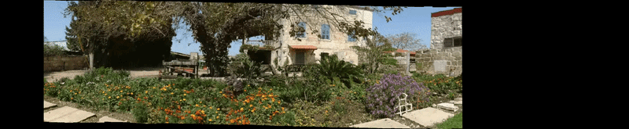

# stereo-mosaicing-panorama

# Stereo Mosaicing & Panorama Generation

A robust computer vision pipeline designed to transform video sequences into high-resolution, seamless panoramas. The project implements advanced image alignment and stitching techniques to handle camera rotation and translation dynamically.

## Example Results


## Key Features
* **SSD-Based Direct Image Alignment:** High-precision motion estimation between consecutive frames.
* **Hierarchical Coarse-to-Fine Estimation:** Utilizes Gaussian pyramids to ensure robust alignment across different resolutions.
* **Rigid Transformation Accumulation:** Accurately tracks global positioning by accumulating transformations over long sequences.
* **Seamless Blending:** Features feathering-based blending and bilinear interpolation to eliminate visible seams.

## Tech Stack
* **Language:** Python
* **Core Libraries:** OpenCV, NumPy, Matplotlib.
* **Algorithms:** Direct Image Alignment (SSD), Inverse Warping, Gaussian Pyramids, Strip Mosaicing.

## Engineering Highlights
* **Hierarchical Flow:** Developed a multi-scale alignment process to handle significant camera motion while maintaining pixel-level accuracy.
* **Transformation Stability:** Implemented logic for accumulating rigid transformations that remains stable even across extended video clips.
* **Optimized Processing:** Leveraged NumPy's vectorized operations for efficient frame-by-frame processing and bilinear interpolation.

## Running

First, install the required dependencies:
```bash
pip install -r requirements.txt
```
Then, you can generate a panorama using the following interface:
```python
from stereo_mosaicing import generate_panorama

panoramas = generate_panorama(
    input_frames_path="input_frames/",
    n_out_frames=5
)
```
